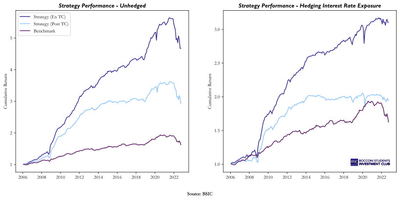
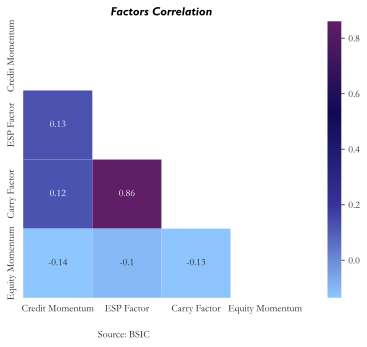

 

  

  <h3 align="center">BSIC Systematic Factor Investing in Credit</h3>

  

    Code for the article on Systematic Factor Investing in Credit
     
     
    <a href="https://bsic.it/a-systematic-approach-to-credit-investing/"><strong>Read the article »</strong></a>
  

## About the Code

The code is grouped in the following directories: 

* `src`
    * `preprocessing`: data gathering from *WRDS*, [*openbondassetpricing.com*](https://openbondassetpricing.com/), and *CRSP*, and Data Cleaning on the bond returns
    * `signals`: partitioning the bonds in buckets and 
    evaluating the signals for our strategy: value, equity momentum, credit momentum, carry, and quality
    * `backtesting`: backtesting the strategy and displaying the results
* `docs`: the manual from [*openbondassetpricing.com*](https://openbondassetpricing.com/) which explains the variables in the DataFrame

## Sneak Peek

